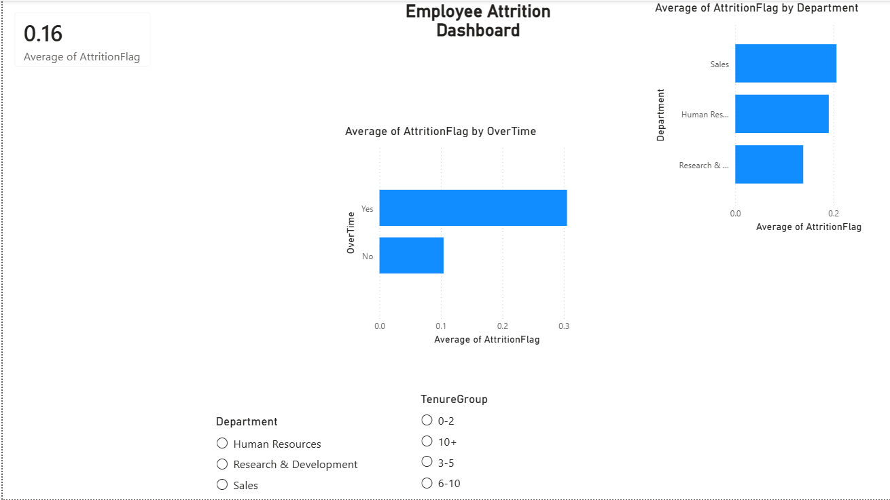

# Employee Attrition Analysis

## Problem Statement
[Company]'s HR team wants to understand why employees are leaving and which
groups are at highest risk, so they can target retention efforts where they'll
have the most impact. This project analyzes an HR dataset of 1,470 employees
to identify the strongest drivers of attrition and recommend specific actions.

## Tools Used
- SQL (SQLite) - data querying and aggregation
- Python (pandas, scikit-learn, matplotlib/seaborn) - data cleaning, correlation
  analysis, and a logistic regression model to rank attrition drivers
- Power BI - interactive dashboard for HR stakeholders

## Approach
1. Loaded and cleaned the raw dataset, removing duplicates and engineering new
   features (TenureGroup, SalaryBand).
2. Wrote SQL queries to calculate attrition rates by department, job role,
   overtime status, tenure, and job satisfaction (see `queries.sql`).
3. Ran a Python analysis (`analysis.py`) to confirm patterns with correlation
   analysis and a logistic regression model identifying the top predictors
   of attrition.
4. Built an interactive Power BI dashboard so HR managers can filter by
   department and tenure group.

## Key Findings
*(Fill these in with your actual numbers after running analysis.py)*
- Overall attrition rate is **16.122449%**.
- Employees working overtime have an attrition rate of **30.5%**, compared to
  **10.4%** for those who don't - the single largest gap found.
- The **[Sales]** department has the highest attrition rate at **20.6%**.
- Employees in their first 0-2 years have a **29.8%** attrition rate, the
  highest of any tenure group.
- Job satisfaction score of 1 (lowest) corresponds to a **22.8%** attrition
  rate, vs **11.3%** for score 4 (highest).
- The logistic regression identified **OverTime**, **EnvironmentSatisfaction**, and
  **WorkLifeBalance** as the strongest predictors of attrition.

## Dashboard

## Recommendations
- Review overtime policy in [Department] - employees working overtime are
  leaving at a significantly higher rate, suggesting burnout risk.
- Strengthen onboarding/mentorship programs for employees in their first
  2 years, since this group shows the highest turnover.
- Investigate compensation in roles where stayers and leavers show the
  largest pay gaps.

## Files in this repo
- `HR_Attrition.csv` - raw dataset (or sample)
- `queries.sql` - SQL analysis queries
- `analysis.py` - Python cleaning, analysis, and modeling script
- `chart_*.png` - supporting charts
- `dashboard.pbix` - Power BI dashboard file
- `dashboard_screenshot.png` - dashboard preview image
